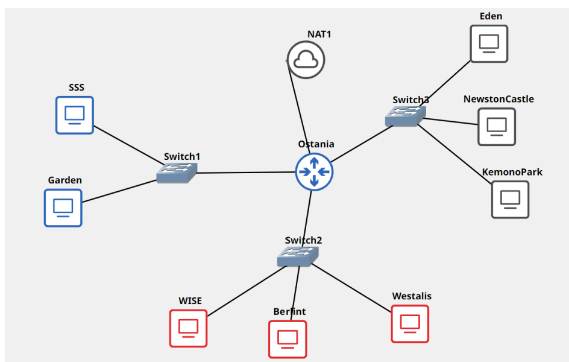
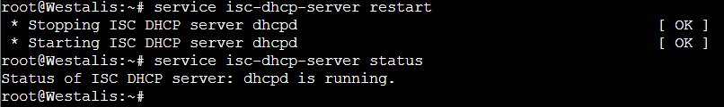
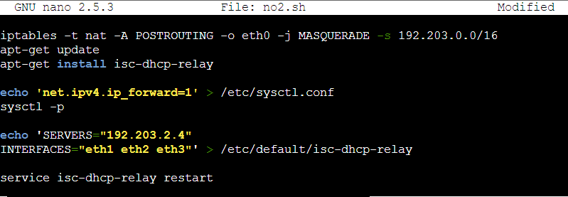
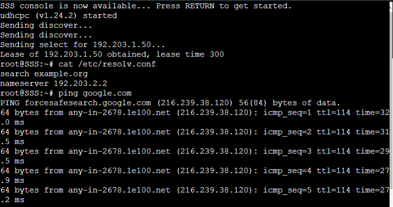
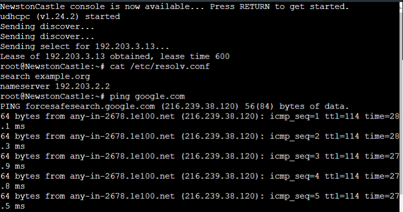
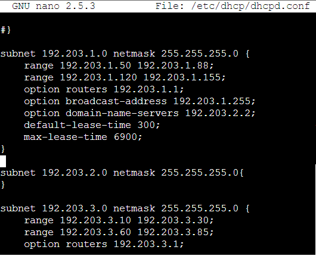
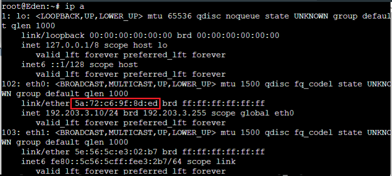
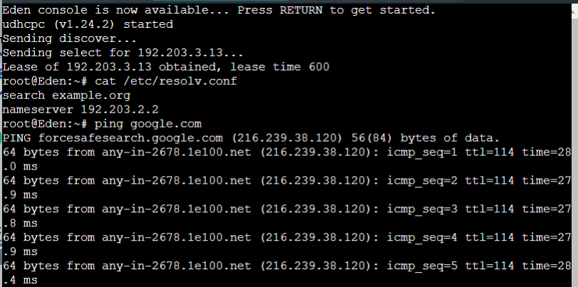

# Jarkom-Modul-3-F08-2022
David Fischer Simanjuntak - 5025201123  
Nabila Zakiyah Khansa Machrus	- 5025201139  
Muhammad Rolanov Wowor - 5025201017  

## Laporan Resmi Modul 3 F08 2022

<ul>
<li>Konfigurasi OSTANIA
</ul>

    auto eth0
    iface eth0 inet dhcp

    auto eth1
    iface eth1 inet static
	address 192.203.1.1
	netmask 255.255.255.0

    auto eth2
    iface eth2 inet static
	address 192.203.2.1
	netmask 255.255.255.0

    auto eth3
    iface eth3 inet static
	address 192.203.3.1
	netmask 255.255.255.0

<ul>
<li>Konfigurasi SSS & Garden
</ul>

    auto eth0
    iface eth0 inet dhcp

<ul>
<li>Konfigurasi WISE
</ul>

    auto eth0
    iface eth0 inet static
	address 192.203.2.2
	netmask 255.255.255.0
	gateway 192.203.2.1

<ul>
<li>Konfigurasi BERLINT
</ul>

    auto eth0
    iface eth0 inet static
	address 192.203.2.3
	netmask 255.255.255.0
	gateway 192.203.2.1

<ul>
<li>Konfigurasi WESTALIS
</ul>

    auto eth0
    iface eth0 inet static
	address 192.203.2.4
	netmask 255.255.255.0
	gateway 192.203.2.1

<ul>
<li>Konfigurasi EDEN
</ul>

	auto eth0
	iface eth0 inet static
  	address 192.203.3.2
  	netmask 255.255.255.0
  	gateway 192.203.3.1

<ul>
<li>Konfigurasi NEWSTON CASTLE
</ul>

	auto eth0
	iface eth0 inet static
  	address 192.203.3.3
  	netmask 255.255.255.0
  	gateway 192.203.3.1

<ul>
<li>Konfigurasi KEMONO PARK 
</ul>

	auto eth0
	iface eth0 inet static
  	address 192.203.3.4
  	netmask 255.255.255.0
  	gateway 192.203.3.1

### **Soal 1**
WISE sebagai DNS Server, Westalis sebagai DHCP Server, Berlint sebagai Proxy Server

### **Jawaban**
<ul>
<li> WISE sebagai DNS server, melakukan instalasi bind
</ul>

	apt-get update
	apt-get install bind9 -y
	service bind9 start
	service bind9 status
	
<ul>
<li> WESTALIS sebagai DHCP server, melakukan instalasi isc-dhcp-server
</ul>

	apt-get update
	apt-get install isc-dhcp-server -y

<ul>
<li> BERLINT sebagai Proxy server, melakukan instalasi squid
</ul>

	apt-get update
	apt-get install squid -y
	service squid restart
	service squid status

### **Soal 2**
Ostania sebagai DHCP Relay 

### **Jawaban**
<ul>
<li> OSTANIA
</ul>

	apt-get update
	apt-get install isc-dhcp-relay -y

	nano /etc/default/isc-dhcp-relay
	SERVERS = "192.203.2.4"
	INTERFACES = "eth1 eth2 eth3"

	service isc-dhcp-relay restart
	service isc-dhcp-server status

### **Soal 3**
Client yang melalui Switch1 mendapatkan range IP dari [prefix IP].1.50 - [prefix IP].1.88 dan [prefix IP].1.120 - [prefix IP].1.155

### **Jawaban**
<ul>
<li> WESTALIS
</ul>

	nano /etc/default/isc-dhcp-server
	INTERFACES = "eth0"

	nano /etc/dhcp/dhcpd.conf
	subnet 192.203.2.0 netmask 255.255.255.0 {
  	option routers 192.203.2.1;
	}
	
	subnet 10.8.1.0 netmask 255.255.255.0 {
  	range 192.203.1.50 192.203.1.88;
  	range 192.203.1.120 192.203.1.155;
  	option routers 192.203.1.1;
  	option broadcast-address 192.203.1.255;
  	option domain-name-servers 192.203.2.2;
  	default-lease-time 300;
 	 max-lease-time 6900;
	}

	service isc-dhcp-server restart
	service isc-dhcp-server status

### **Soal 4**
Client yang melalui Switch3 mendapatkan range IP dari [prefix IP].3.10 - [prefix IP].3.30 dan [prefix IP].3.60 - [prefix IP].3.85

### **Jawaban**
<ul>
<li> WESTALIS
</ul>

	nano /etc/dhcp/dhcpd.conf
	subnet 192.203.3.0 netmask 255.255.255.0 {
  	range 192.203.3.10 192.203.3.30;
  	range 192.203.3.60 192.203.3.85;
  	option routers 192.203.3.1;
  	option broadcast-address 192.203.3.255;
  	option domain-name-servers 192.203.2.2;
  	default-lease-time 600;
  	max-lease-time 6900;
	}

	service isc-dhcp-server restart
	service isc-dhcp-server status

### **Soal 5**
Client mendapatkan DNS dari WISE dan client dapat terhubung dengan internet melalui DNS tersebut

### **Jawaban**
<ul>
<li> WISE
</ul>

	nano /etc/bind/named.conf.options
	forwarders {
    	192.203.2.1;
	}; 

	// dnssec-validation auto;
	allow-query{any;};
	service bind9 restart

---Client

	ping 192.203.2.2
	ping google.com

Testing client dari switch 1: SSS 

Testing client dari switch 3: NewstonCastle 

### **Soal 6**
Lama waktu DHCP server meminjamkan alamat IP kepada Client yang melalui Switch1 selama 5 menit sedangkan pada client yang melalui Switch3 selama 10 menit. Dengan waktu maksimal yang dialokasikan untuk peminjaman alamat IP selama 115 menit. 

### **Jawaban**
<ul>
<li> WESTALIS
</ul>

	nano /etc/dhcp/dhcpd.conf
	subnet 192.203.1.0 netmask 255.255.255.0 {
  	range 192.203.1.50 192.203.1.88;
  	range 192.203.1.120 192.203.1.155;
  	option routers 192.203.1.1;
  	option broadcast-address 192.203.1.255;
  	option domain-name-servers 192.203.2.2;
  	default-lease-time 300;
  	max-lease-time 6900;
	}
	
	subnet 192.203.3.0 netmask 255.255.255.0 {
  	range 192.203.3.10 192.203.3.30;
  	range 192.203.3.60 192.203.3.85;
  	option routers 192.203.3.1;
  	option broadcast-address 192.203.3.255;
  	option domain-name-servers 192.203.2.2;
  	default-lease-time 600;
  	max-lease-time 6900;
	}

hingga konfigurasi akhir dari dhcpd.conf di Westalis adalah sebagai berikut: 

### **Soal 7**
Eden sebagai server untuk pertukaran informasi dengan alamat IP yang tetap dengan IP [prefix IP].3.13

### **Jawaban**
Pertama-tama mendapatkan hardware address untuk eden dengan menggunakan command <code>ip a </code> di client Eden:

kemudian melakukan perubahan file <code> /etc/dhcp/dhcpd.conf</code> di Westalis
<ul>
<li> WESTALIS
</ul>

	nano /etc/dhcp/dhcpd.conf
	host Eden {
    	hardware ethernet f6:09:9e:66:0d:94;
    	fixed-address 192.203.3.13;
	}

Kemudian restart kembali Eden, dan berhasil terhubung dengan fixed address 192.203.3.13:

### **Soal 8**
Client hanya dapat mengakses internet diluar (selain) hari & jam kerja (senin-jumat 08.00 - 1 7.00) dan hari libur (dapat mengakses 24 jam penuh)

### **Jawaban**

### **Soal 9**
Adapun pada hari dan jam kerja sesuai nomor (1 ), client hanya dapat mengakses domain loid-work.com dan franky-work.com (IP tujuan domain dibebaskan)

### **Jawaban**

### **Soal 10**
Saat akses internet dibuka, client dilarang untuk mengakses web tanpa HTTPS. (Contoh web HTTP: http://example.com)

### **Jawaban**

### **Soal 11**
Agar menghemat penggunaan, akses internet dibatasi dengan kecepatan maksimum 1 28 Kbps pada setiap host (Kbps = kilobit per second; lakukan pengecekan pada tiap host, ketika 2 host akses internet pada saat bersamaan, keduanya mendapatkan speed maksimal yaitu 1 28 Kbps)

### **Jawaban**

### **Soal 12**
Setelah diterapkan, ternyata peraturan nomor (4) mengganggu produktifitas saat hari kerja, dengan demikian pembatasan kecepatan hanya diberlakukan untuk pengaksesan internet pada hari libur

### **Jawaban**
